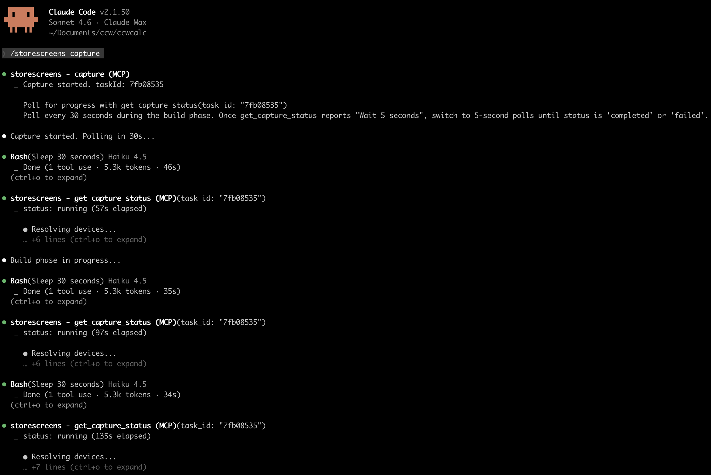
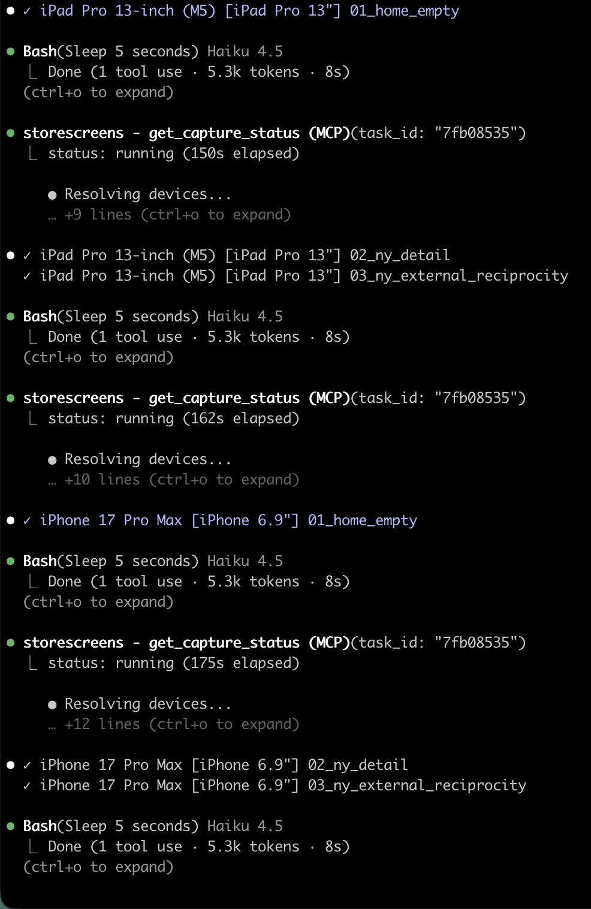

# storescreens-skill

Agent skill for [storescreens-cli](https://github.com/storescreens/storescreens-cli) - the CLI that captures App Store screenshots across every required device size in one command.

This skill lets an AI coding assistant handle the entire setup: installing the CLI, detecting your Xcode project, configuring devices, generating UI tests, and running captures. It also supports **targeted screenshots** for quick visual checks during development - capture the current simulator screen in under a second without building or running tests.

https://github.com/storescreens/storescreens-cli/raw/main/demo.mov

## Prerequisites

The skill installs [storescreens-cli](https://github.com/storescreens/storescreens-cli) via Homebrew automatically if it's not already on your machine. You need **macOS 14+** and **Xcode 16+**.

## Usage

Point your AI coding assistant at `SKILL.md` or load `storescreens.skill` as a skill package. Works with any assistant that supports skills or custom instructions.

## What the Agent Does

1. Installs [storescreens-cli](https://github.com/storescreens/storescreens-cli) (and `storescreens-mcp`) if needed
2. Detects the Xcode project and scheme
3. Generates `storescreens.yml` with the right devices for all required App Store sizes
4. Sets up a UI test target and `ScreenshotTests.swift` with navigation for each screen
5. Configures screenshot mode in the app (pro access, disabled animations, sample data)
6. Adds accessibility identifiers for reliable element targeting
7. Runs preflight checks — errors and warnings are surfaced before capture, with a prompt to fix or continue
8. Runs capture (via MCP tools when available, CLI otherwise)
9. Troubleshoots failures using build logs

## MCP Server

When `storescreens-mcp` is configured in `.mcp.json`, the agent uses structured MCP tools instead of Bash calls. This gives it per-screenshot progress inline and structured results without requiring it to parse terminal output.

Available tools:

| Tool | Description |
|------|-------------|
| `capture` | Start full App Store screenshot capture in background |
| `get_capture_status` | Poll progress for a running capture |
| `get_capture_result` | Fetch full manifest once capture is complete |
| `take_screenshot` | Capture current simulator screen and return image inline (<1 second) |
| `check` | Run preflight scan for common issues |
| `list_simulators` | List available simulators grouped by App Store slot |
| `list_screenshots` | List screenshots from the last capture |
| `get_screenshot` | Load a saved PNG as inline image |
| `read_config` / `write_config` | Read or write `storescreens.yml` |

See [storescreens-cli](https://github.com/storescreens/storescreens-cli#agent-skill) for setup instructions.

## Works with Xcode MCP (Xcode 26.3+)

storescreens complements [Xcode's built-in MCP server](https://developer.apple.com/documentation/xcode/giving-agentic-coding-tools-access-to-xcode). When both are available, the agent picks the right tool for each situation:

| Tool | What it captures | When to use |
|------|-----------------|-------------|
| Xcode `RenderPreview` | A single SwiftUI `#Preview` | Checking an individual view's layout. No simulator needed. |
| storescreens `take_screenshot` | The full running app in a simulator | Checking the app with real data, navigation, and system chrome. |
| storescreens `capture` | Full App Store screenshots | Final screenshots across multiple devices, locales, and appearances. |

## Contents

- **`SKILL.md`** — Step-by-step instructions for the agent
- **`storescreens.skill`** — Packaged skill archive (SKILL.md + references + assets)
- **`references/config-reference.md`** — Full `storescreens.yml` config schema
- **`assets/ScreenshotTests.swift.template`** — Starter UI test template

## Related

- [storescreens-cli](https://github.com/storescreens/storescreens-cli) — The CLI tool this skill automates

## License

MIT
